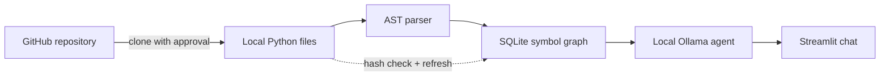

# Repository Agent

Repository Agent is a local AI assistant for exploring Python codebases. Give it a public GitHub repository, approve the clone and parse steps, and then ask questions about how the code works through a Streamlit chat interface.

It uses a local Ollama model for conversation and a SQLite database for the repository's source, symbols, imports, and relationships.

## Current project capabilities 

- Clone public GitHub repositories over HTTPS into a controlled local directory.
- Ask for approval before cloning or parsing anything.
- Parse Python files with Python's AST rather than relying on text matching.
- Find classes, functions, methods, async callables, and nested definitions.
- Preserve qualified names, signatures, docstrings, decorators, and source locations.
- Record imports and aliases.
- Build relationships for containment, inheritance, instantiation, and function calls.
- Mark each reference as `resolved`, `ambiguous`, `unresolved`, or `external` instead of guessing when the target is unclear.
- Store complete source files and SHA-256 hashes in SQLite.
- Detect added, removed, or modified Python files and automatically refresh stale repository data.
- Answer questions about implementation details, call chains, and dependencies using the stored source and graph.
- Keep separate chat sessions in the Streamlit UI.

## Basic flow of project




## How a typical session works

1. Start the app and ask it to clone a public GitHub repository.
2. Review and approve the proposed clone operation.
3. Tell the agent to parse the cloned repository, then approve that operation separately.
4. Ask questions such as:
   - "What does `Service.run` do?"
   - "Which functions call `save`?"
   - "What does this class inherit from?"
   - "Walk me through the chain from this function to the database call."
5. Keep working on the repository normally. Before answering later questions, the app compares the current Python files with their stored hashes and reparses the repository when needed.

## What gets stored

The generated `call_graph.db` database contains:

- Repository and file paths
- Complete Python source text
- SHA-256 file hashes
- Symbols and their lexical parents
- Function signatures, docstrings, decorators, and line ranges
- Imports and aliases
- `contains`, `inherits`, `instantiates`, and `calls` edges
- Resolution status and the original expression for every discovered reference

This gives the agent both structured relationships and the real source code. It can use the graph to locate the right area, then read the implementation before answering.

## Run it on your local PC

### 1. Install the prerequisites

- [Git](https://git-scm.com/)
- Python 3.12 or a compatible version
- [Ollama](https://ollama.com/) running locally

After installing them, open PowerShell and check that each command is available:

```powershell
git --version
python --version
ollama --version
```

### 2. Open the project

If you already have the project on your PC, move into its folder:

```powershell
cd path\to\GitHub-Assistance
```

If you are downloading it from GitHub for the first time, clone it and then enter the new folder:

```powershell
git clone https://github.com/OWNER/REPOSITORY.git
cd REPOSITORY
```

Replace the example URL and folder name with the real ones for this project.

### 3. Create the Python environment

Create and activate a virtual environment, then install the Python dependencies:

```powershell
python -m venv .venv
.\.venv\Scripts\Activate.ps1
python -m pip install --upgrade pip
pip install -r requirements.txt
```

### 4. Download and start the local model

This project currently uses **`qwen3.5:2b-q4_K_M`** by default. Pull that exact model with Ollama:

```powershell
ollama pull qwen3.5:2b-q4_K_M
```

Ollama normally starts its local service after installation. If it is not already running, open another PowerShell window and run:

```powershell
ollama serve
```

You can confirm the model works before launching the app:

```powershell
ollama run qwen3.5:2b-q4_K_M
```

The application expects Ollama at `http://127.0.0.1:11434`.

### 5. Start Repository Agent

From the project folder, with the virtual environment active, run:

```powershell
streamlit run app.py
```

Streamlit should open the interface in your browser. If it does not, use the local URL printed in the terminal, usually `http://localhost:8501`.

To stop the app, press `Ctrl+C` in its terminal. To leave the Python environment afterward, run `deactivate`.

### Using a different model

Set `OLLAMA_MODEL` before starting Streamlit:

```powershell
$env:OLLAMA_MODEL = "your-model-name"
streamlit run app.py
```

## Basic GPU memory estimate

The model name breaks down like this:

- `2b` means roughly two billion parameters.
- `q4_K_M` is a 4-bit quantization, designed to reduce the memory needed for the model weights.

A simplified weights-only calculation is:

```text
2 billion parameters x 4 bits = 8 billion bits
8 billion bits / 8 = roughly 1 GB
```


## Running the tests

```bash
python -m unittest discover -s tests
```

The current tests cover scoped symbol extraction, imports, inheritance, internal and external calls, instantiation edges, unresolved references, and repository hash checks.

## Current boundaries

The parser currently focuses on Python. Its static resolution understands lexical scope, `self` and `cls`, explicit class expressions, imports, and unique repository-wide names, but it does not yet perform advanced type inference.

That means dynamic dispatch, runtime-generated functions, monkey-patching, and some indirect calls cannot always be resolved ahead of time. The application keeps those ambiguous or unresolved edges, but it does not present them as verified relationships. Large repositories may also need a larger local model or a more selective retrieval strategy.

## Future Goals

Adding an interactive node graph that documents functions that it calls along with a small summary.
